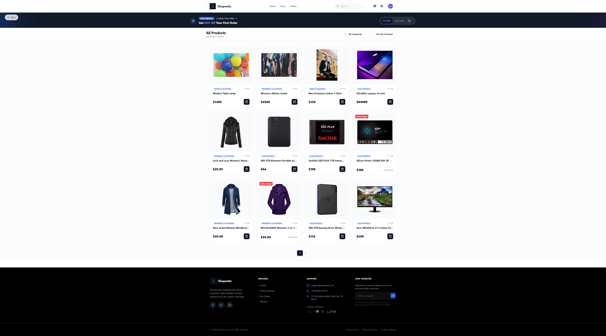
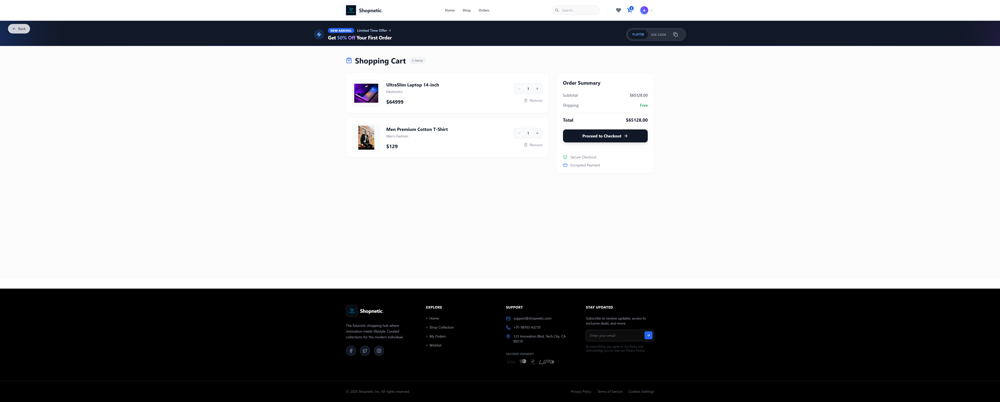
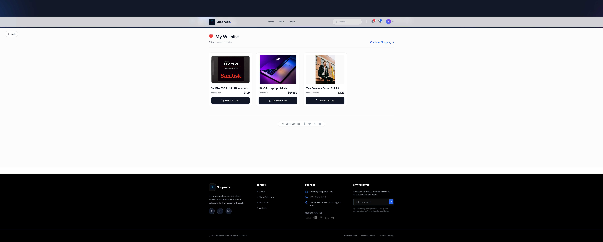
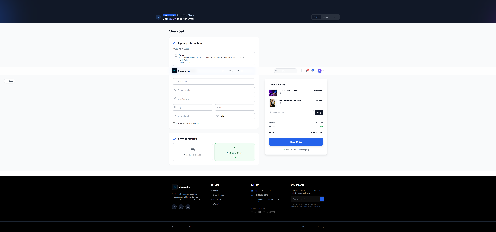
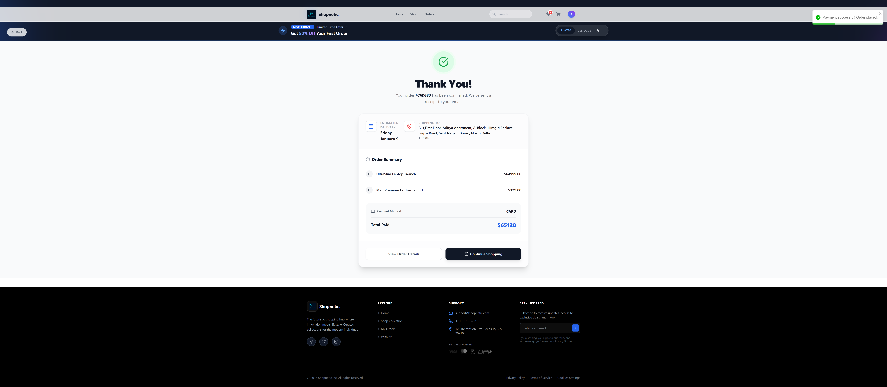
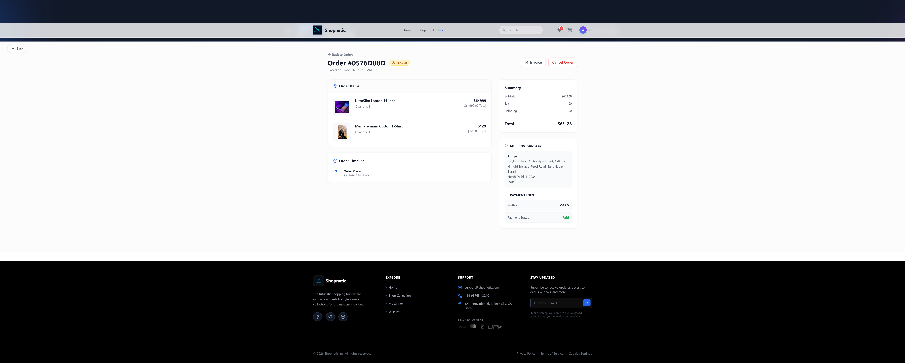
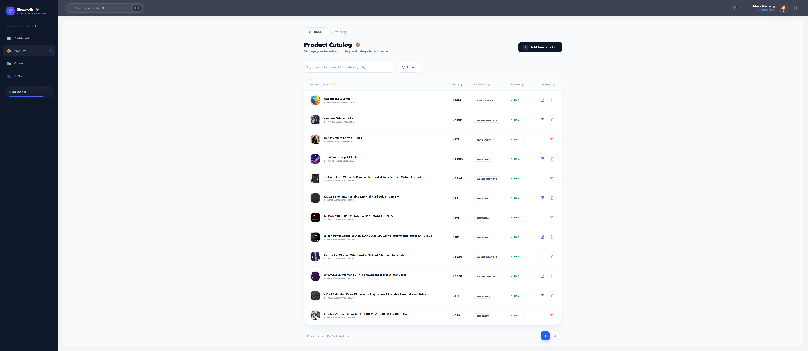
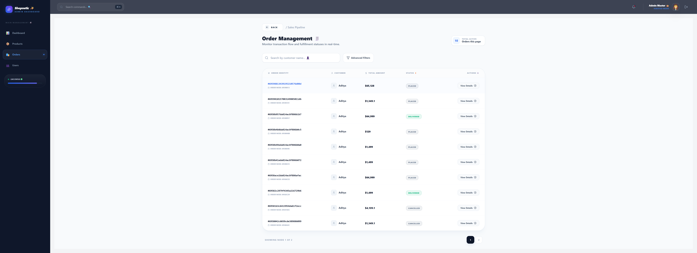
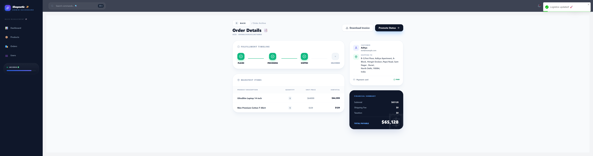
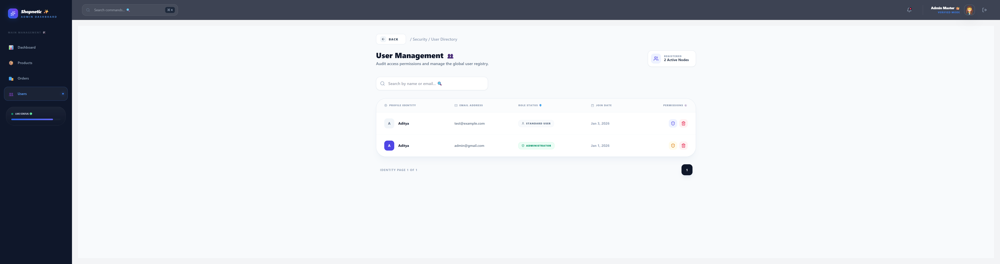

# 🛒 Shopnetic — Full-Stack E-commerce Frontend

A modern, responsive E-commerce Frontend Application built with React, Redux Toolkit, Tailwind CSS, and REST API integration, featuring user & admin dashboards, authentication, cart & wishlist management, checkout flow, and admin controls.

This project demonstrates real-world frontend architecture, role-based routing, state management, and production-grade UI patterns.

---

## 🌐 Live Demo

- **Frontend Deployment:** [https://lively-truffle-50078c.netlify.app/](https://lively-truffle-50078c.netlify.app/)
- **Backend Deployment:** [https://ecommerce-backend-hen7.onrender.com/](https://ecommerce-backend-hen7.onrender.com/)

---

## 📌 Key Features

### 👤 User Features

- User authentication (Login / Signup / Forgot / Reset Password)
- Product browsing with categories, search & sorting
- Product details page with ratings & stock info
- Cart management (Add / Remove / Update quantity)
- Wishlist management
- Secure checkout flow
- Payment integration (Stripe / COD support) and Coupon Logic implemented
- Order history & order details
- Responsive UI (Mobile + Desktop)

### 🛠️ Admin Features

- Admin-only protected routes
- Admin dashboard with analytics
- Product management (Create / Edit / Delete)
- Order management & status updates
- User management (Admin toggle, delete user)
- Role-based access control (Admin vs User)

---

## 🛠 Tech Stack

### Frontend

- React (Hooks & Functional Components)
- Redux Toolkit (Global state management)
- React Router v6 (Routing & route guards)
- Tailwind CSS (Utility-first styling)
- Lucide React Icons
- Axios (API communication)
- Recharts (Admin analytics & charts)

### State Management

- Auth Slice
- Cart Slice
- Wishlist Slice
- Product Slice
- Order Slice
- UI Slice (Global loaders)

### 🔐 Authentication & Route Protection

- JWT-based authentication
- Tokens stored securely in localStorage
- Axios interceptors auto-attach token
- Global 401 handling → auto logout & redirect
- Route Guards:
- UserRoute.jsx → blocks admin from user pages
- AdminRoute.jsx → blocks non-admin access

### 🛒 Cart & Wishlist Logic

- Fully Redux-driven
- Prevents API calls when user is logged out
- Graceful UX handling:
- Login prompt instead of silent failure
- No infinite loaders
- Cart & wishlist counters synced globally

### 💳 Checkout & Payments

- Secure checkout flow
- Payment method selection
- Stripe payment integration
- Order creation on successful payment
- Cart auto-cleared post checkout
- Order confirmation page

### 🎨 UI & UX Highlights

- Fully responsive design
- Skeleton loaders for better perceived performance
- Global loader overlay during async actions
- Consistent admin & user UI separation
- Accessible, clean component structure

### 📄 Code Quality & Documentation

- Consistent file-level headers across all files:
- File purpose
- Responsibilities
- Notes
- Clean, readable component structure
- No dead code or unused logic
- Centralized API & error handling


### 🧪 Testing Status
- Manual functional testing completed
- Auth, cart, wishlist & checkout flows verified
- API error handling tested (401, empty states)

### 📊 Admin Analytics Dashboard

- The admin dashboard provides real-time business insights using data-driven charts:
- 📈 Order trends over time
- 💰 Revenue analytics
- 🎯 Order status distribution
- 📦 Product & user statistics

Charts are implemented using Recharts, ensuring responsive and interactive visualizations.

### 🧾 Order Invoice PDF Download

- Users can download PDF invoices from:
- Order details page
- Admins can download invoices from:
- Admin order details page
- PDFs are generated by the backend and securely streamed to the frontend
- Frontend handles:
- File download
- Blob conversion
- Auto file naming

---

## 📂 Project Structure

```plaintext
src/
├── components/
│   ├── layout/
│   │   ├── Navbar.jsx
│   │   ├── Footer.jsx
│   │   └── Banner.jsx
│   ├── common/
│   │   ├── BackButton.jsx
│   │   └── GlobalLoader.jsx
│
├── pages/
│   ├── user/
│   │   ├── Home.jsx
│   │   ├── Shop.jsx
│   │   ├── ProductDetails.jsx
│   │   ├── Cart.jsx
│   │   ├── Wishlist.jsx
│   │   ├── Checkout.jsx
│   │   ├── PaymentForm.jsx
│   │   ├── OrderHistory.jsx
│   │   └── ThankYou.jsx
│   │
│   ├── admin/
│   │   ├── AdminDashboard.jsx   # Analytics & Charts
│   │   ├── ProductList.jsx
│   │   ├── ProductEdit.jsx
│   │   ├── OrderList.jsx
│   │   ├── OrderDetails.jsx     # PDF Invoice Download
│   │   └── UserList.jsx
│
├── redux/
│   ├── store.js
│   └── slices/
│       ├── authSlice.js
│       ├── cartSlice.js
│       ├── wishlistSlice.js
│       ├── productSlice.js
│       ├── orderSlice.js
│       └── uiSlice.js
│
├── routes/
│   ├── UserRoute.jsx
│   └── AdminRoute.jsx
│
├── config/
│   └── api.js
│
└── App.jsx
```
---

## 📸 Screenshots

- The following screenshots demonstrate the complete user and admin workflows of the Shopnetic E-commerce application, covering authentication, product browsing, checkout, order management, invoice downloads, and admin analytics.

## 👤 User Flow Screenshots

### 🏠 Home Page
- Displays the landing page with navbar, banner, featured products, and navigation links.


### 🛍️ Shop / Product Listing
- Shows product grid with categories, filters, search functionality, and pagination.


### 📦 Product Details Page
- Detailed product view including image, price, rating, stock status, and Add to Cart / Wishlist actions.


### 🛒 Cart Page
- Displays selected cart items with quantity controls, price breakdown, and checkout option.


### ❤️ Wishlist Page
- Shows user-saved products with options to remove items or move them to the cart.


### 📍 Checkout Page
- Captures shipping details, order summary, and payment method selection.


### 💳 Payment Page
- Secure payment flow with Stripe / Cash on Delivery options.


### ✅ Order Confirmation (Thank You Page)
- Confirms successful order placement with order ID and order summary.


### 📜 Order History Page
- Lists all previous orders placed by the user.


### 🧾 Order Details Page (User)
- Displays complete order details with Download Invoice (PDF) option.



## 🛠️ Admin Flow Screenshots

### 📊 Admin Dashboard (Analytics)
- Shows real-time analytics charts including order trends, revenue, and order status distribution.


### 📦 Product Management – List View
- Displays all products with options to create, edit, or delete items.


### ✏️ Product Edit Page
- Admin form to update product details including price, stock, image, and category.


### 📑 Order Management – Order List
- Lists all customer orders with status tracking and navigation to order details.


### 🧾 Order Details Page (Admin)
- Detailed order view with status update controls and Invoice PDF download.


### 👥 User Management Page
- Displays registered users with admin role toggle and delete functionality.


---

## 🚀 Setup & Installation

### 1️⃣ Clone the repository

```bash
git clone https://github.com/aditya32193213/ecommerce-react.git
cd ecommerce-react
```

### 2️⃣ Install dependencies
```bash
npm install
```
### 3️⃣ Environment variables
- Create a .env file:
```bash
REACT_APP_API_URL=https://your-backend-api-url
```
4️⃣ Start development server
```bash
npm start
```

### 👨‍💻 Author

- Aditya
- Full-Stack Developer
- 📍 Bangalore, India

### 📜 License

- This project is created for educational & portfolio purposes.

