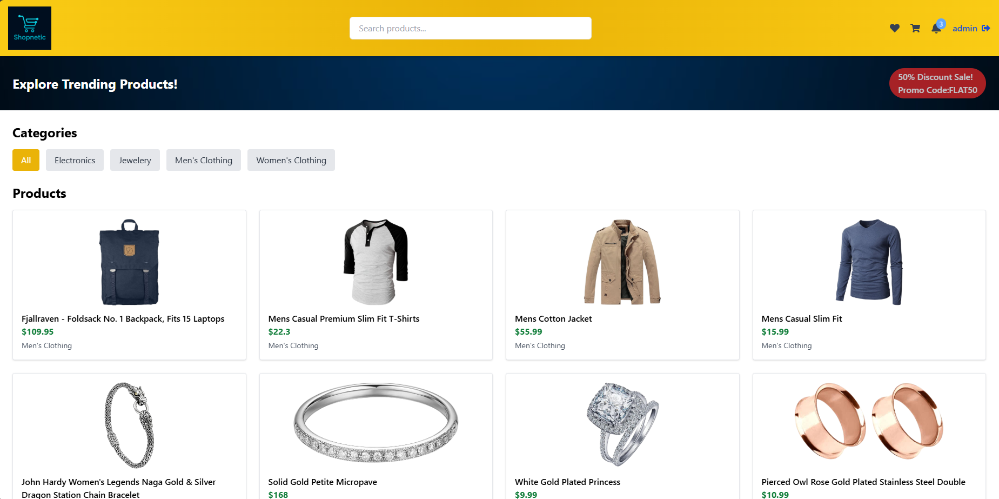
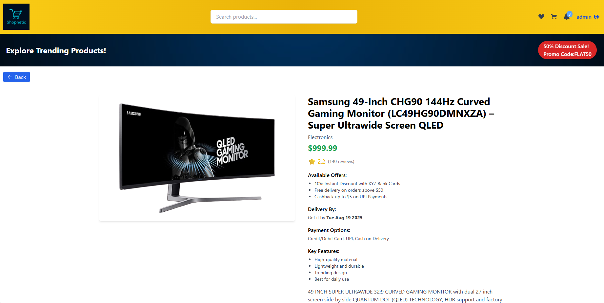

# 🛍️ E-Commerce React App

A sleek, fully responsive **e-commerce web application** built with **React**, **Redux**, and **Tailwind CSS**.  
Designed for a smooth shopping experience with real-time search, category filters, cart & wishlist management, and a mock checkout flow.

---

## ✨ Key Highlights

- 📱 **Responsive UI** – Mobile-first design  
- 🗂 **Category Filters** – Quickly find products  
- 🔍 **Real-Time Search** – Instant results  
- 🛒 **Cart & Wishlist** – Persistent with `localStorage`  
- 💳 **Mock Checkout** – Address, coupon, and payment flow  
- 🧪 **Unit Tested** – Jest + React Testing Library

---

## 🛠 Tech Stack

React • Redux Toolkit • Tailwind CSS • React Router • Jest • Lucide Icons

---
## 📸 Screenshots

Here are some previews of the E-Commerce website:

### 🏠 Homepage


### 🛒 Product Details Page


### 🛍️ Cart Page


## 🚀 Quick Start

```bash
git clone https://github.com/aditya32193213/ecommerce-react.git
cd ecommerce-react
npm install
npm start


